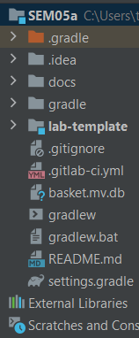

### Anni's Pizza

This is the system we built for Anni's Pizza.
It consists of four microservices (including a gateway). These can be run using their individual Application.java files.

# Gateway
For the gateway we used the Zuul library. This automatically routes the requests to the correct microservices. For more 
information about which endpoints there are and how to run them, please refer to the endpoints.md file in the docs
folder.

# How to set up the project
For a correct set up, build the project from the root. If done correctly, the result should look like this:

You can now run each microservice found in the lab-template folder.