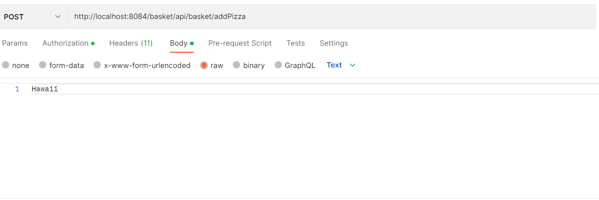

# Endpoints

This file contains the endpoints of the project, and a short explanation on how to call them. The explanation for what
each endpoint does can be found in the JavaDoc for that endpoint. Note that 
http://localhost:8084/{name-of-microservice}/{endpoint} should reach the corresponding microservice via the gateway.
Port 8084 is used for the gateway, which directs all requests. The names of the microservices are: 'user', 'basket' and
'orders'.

The /register and the /authenticate endpoint are the only endpoints which can be accessed without a token. All other
endpoints need a valid token in the authorization header.

Below is an example on how to send plain text:

# Authentication

## AuthenticationController

POST MAPPINGS:
- /register | use the RegistrationRequestModel
- /authenticate | use the AuthenticationRequestModel
- /registerStoreOrManager | use the RegistrationSpecialRequestModel
GET MAPPINGS:
- /allStores
- /verify/{storeID} | specify the storeID in the path

## AllergiesController

POST MAPPINGS:
- /addAllergies | use the AllergiesRequestModel
GET MAPPINGS:
- /getAllergies

# Order

POST MAPPINGS:
- /checkout | use the CheckOutRequestModel
- /cancel | use the CancelOrderRequestModel
GET MAPPINGS:
- /seeOrders

# Basket

## RepoController(/api/repo)

POST MAPPINGS:
- /pizzas/addToRepo | use the PizzaRequestModel
- /ingredients/add | use the IngredientRequestModel
- /coupons/addToRepo | use the CouponRequestModel
DELETE MAPPINGS:
- /coupons/delete | send as body a plain text String, just a String, not even quotation marks
GET MAPPINGS:
- /pizzas/{filterOut} | specify whether you want to filter out pizzas you are allergic to with a boolean in the path
- /ingredients
- /ingredients/allergies
- /coupons
- /coupons/getCoupon | send as body a plain text String, just a String, not even quotation marks

## BasketController(/api/basket)

POST MAPPINGS:
- /addPizza | send as body a plain text String, just a String, not even quotation marks
- /addPizza/custom | use the PizzaRequestModel
- /applyCoupon | send as body a plain text String, just a String, not even quotation marks
- /selectTime | use the TimeRequestModel
- /setStore | send as body a plain text Integer, so just a number
DELETE MAPPINGS:
- /removePizza | send as body a plain text String, just a String, not even quotation marks
- /removeCoupon
GET MAPPINGS:
- /overview
- /get